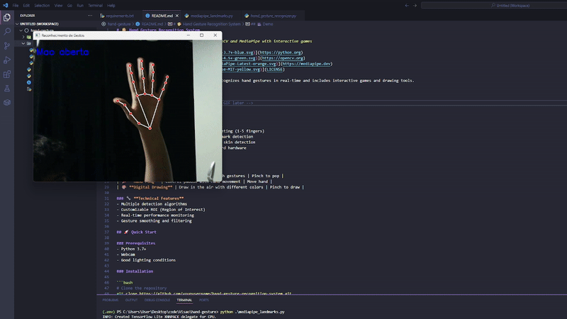

# 🖐️ Sistema de Reconhecimento de Gestos com as Mãos

> Reconhecimento de gestos com as mãos em tempo real usando OpenCV e MediaPipe com jogos interativos

[](https://python.org)
[](https://opencv.org)
[](https://mediapipe.dev)

Um sistema abrangente de visão computacional que reconhece gestos com as mãos em tempo real e inclui jogos interativos e ferramentas de desenho.

## 🎥 Demonstração

 <!-- Adicionar um GIF de demonstração depois -->

## ✨ Funcionalidades

### 🎯 **Reconhecimento Principal**
- **Detecção em Tempo Real**: Contagem avançada de dedos (1-5 dedos)
- **Integração MediaPipe**: Detecção precisa de pontos de referência da mão
- **Múltiplos Modos**: Subtração de fundo + detecção de pele
- **Performance Otimizada**: 30+ FPS em hardware padrão

### 🎮 **Jogos Interativos**
| Jogo | Descrição | Controles |
|------|-----------|-----------|
| 🎈 **Estourar Balões** | Estoure balões usando gestos de pinça | Pinça para estourar |
| 🏓 **Pong Manual** | Controle a raquete com movimento da mão | Mover a mão |
| 🎨 **Desenho Digital** | Desenhe no ar com diferentes cores | Pinça para desenhar |

### 🔧 **Recursos Técnicos**
- Múltiplos algoritmos de detecção
- ROI (Região de Interesse) personalizável
- Monitoramento de performance em tempo real
- Suavização e filtragem de gestos

## 🚀 Início Rápido

### Pré-requisitos
- Python 3.7+
- Webcam
- Condições de iluminação adequadas

### Instalação

```bash
# Clone o repositório
git clone https://github.com/seuusuario/sistema-reconhecimento-gestos-maos.git
cd sistema-reconhecimento-gestos-maos

# Instale as dependências
pip install -r requirements.txt
```

### Uso Básico

```bash
# Inicie o sistema principal de reconhecimento
python hand_gesture_recognizer.py

# Experimente o reconhecimento baseado em MediaPipe
python mediapipe_landmarks.py

# Jogue os jogos
python games/click.py      # Estourar Balões
python games/pong.py       # Pong Manual
python games/draw.py       # Desenho Digital
```

## 🎮 Guia dos Jogos

### 🎈 Estourar Balões
- **Objetivo**: Estoure o máximo de balões possível em 60 segundos
- **Controles**: Faça o gesto de pinça (polegar + indicador)
- **Pontuação**: +1 ponto por balão

### 🏓 Pong Manual
- **Objetivo**: Mantenha a bola em jogo
- **Controles**: Mova a mão para controlar a raquete
- **Desafio**: A velocidade aumenta com o tempo

### 🎨 Desenho Digital
- **Recursos**: Paleta de cores, espessura variável do pincel
- **Controles**: 
  - Pinça para desenhar
  - Clique nas cores para mudar
  - Use o botão "LIMPAR" para apagar

## 🛠️ Configuração

### Controles do Sistema Principal
```python
# Atalhos de teclado em hand_gesture_recognizer.py
'b' - Capturar fundo (primeiro passo obrigatório)
's' - Alternar modo de detecção de pele
'm' - Mostrar/ocultar máscara de detecção
'r' - Reiniciar sistema
'q' - Sair da aplicação
```

### Personalização
```python
# Ajustar ROI em hand_gesture_recognizer.py
roi = {
    'top': 50, 'bottom': 450,
    'left': 150, 'right': 550
}

# Configurações do MediaPipe
min_detection_confidence = 0.7
min_tracking_confidence = 0.5
```

## 📊 Performance

- **FPS**: 30+ em hardware padrão
- **Latência**: <50ms detecção de gestos
- **Precisão**: 95%+ em boa iluminação
- **Memória**: ~100MB uso de RAM

## 🔍 Solução de Problemas

<details>
<summary><b>Problemas com a Câmera</b></summary>

```python
# Tente diferentes índices de câmera
cap = cv2.VideoCapture(1)  # ou 2, 3...
```
</details>

<details>
<summary><b>Detecção Ruim</b></summary>

- Garanta iluminação boa e uniforme
- Capture o fundo sem a mão no quadro
- Use fundo contrastante
- Mantenha a mão dentro da caixa verde ROI
</details>

<details>
<summary><b>Problemas de Performance</b></summary>

- Feche outras aplicações da câmera
- Reduza a resolução do quadro se necessário
- Verifique as capacidades de FPS da webcam
</details>

## 🏗️ Arquitetura

```
├── 📁 games/
│   ├── 🎈 click.py          # Jogo Estourar Balões
│   ├── 🏓 pong.py           # Jogo Pong Manual
│   └── 🎨 draw.py           # Aplicação de Desenho
├── 🤖 hand_gesture_recognizer.py  # Sistema principal de reconhecimento
├── 📊 mediapipe_landmarks.py      # Implementação MediaPipe
├── 📋 requirements.txt            # Dependências
└── 📖 README.md                   # Documentação
```


- [OpenCV](https://opencv.org) - Computer vision library
- [MediaPipe](https://mediapipe.dev) - Hand tracking solution
- [Python](https://python.org) - Programming language
- [NumPy](https://numpy.org) - Numerical computing


<div align="center">

**⭐ Dê uma estrela neste repositório se ele foi útil para você!**


</div>
